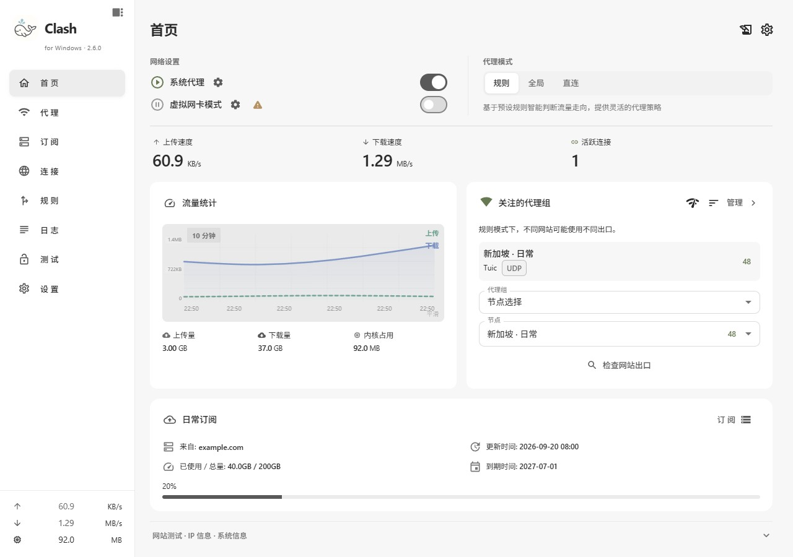
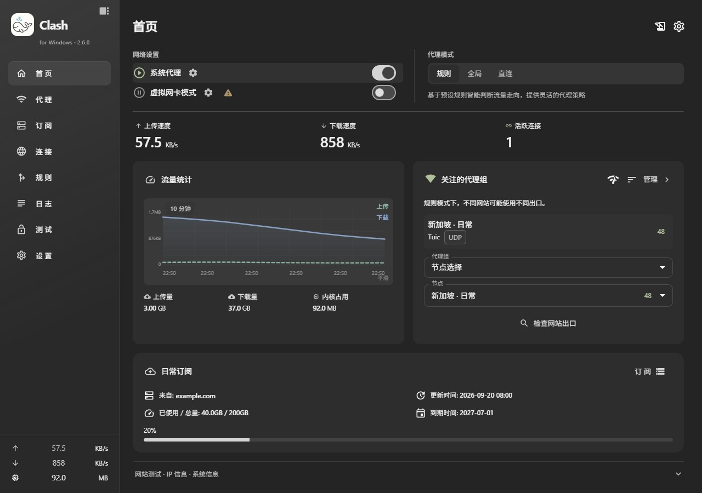
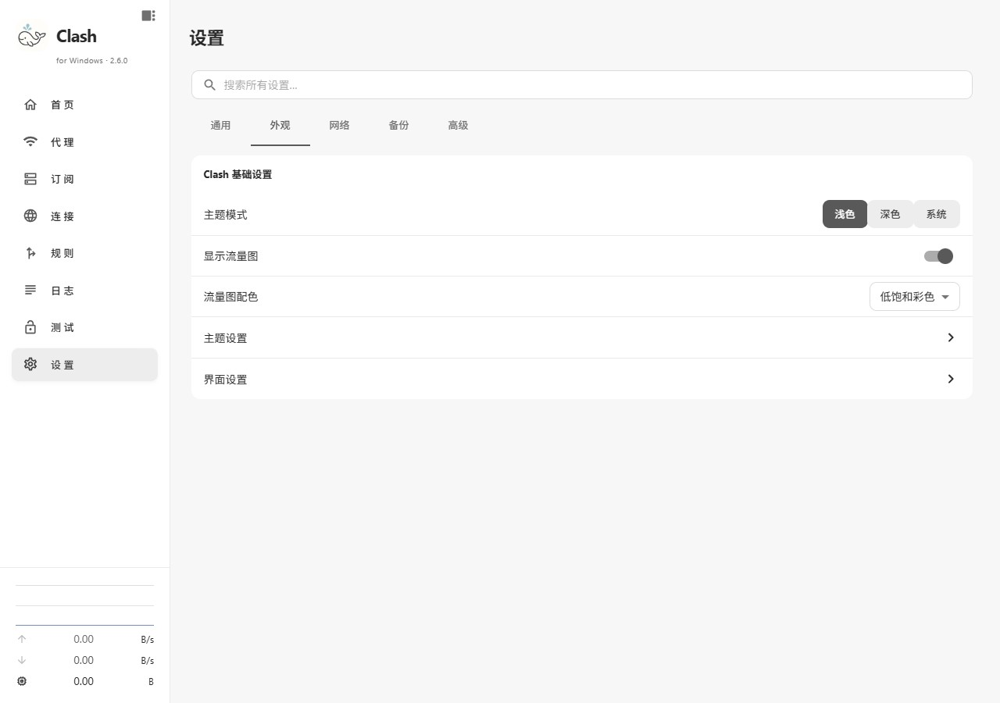
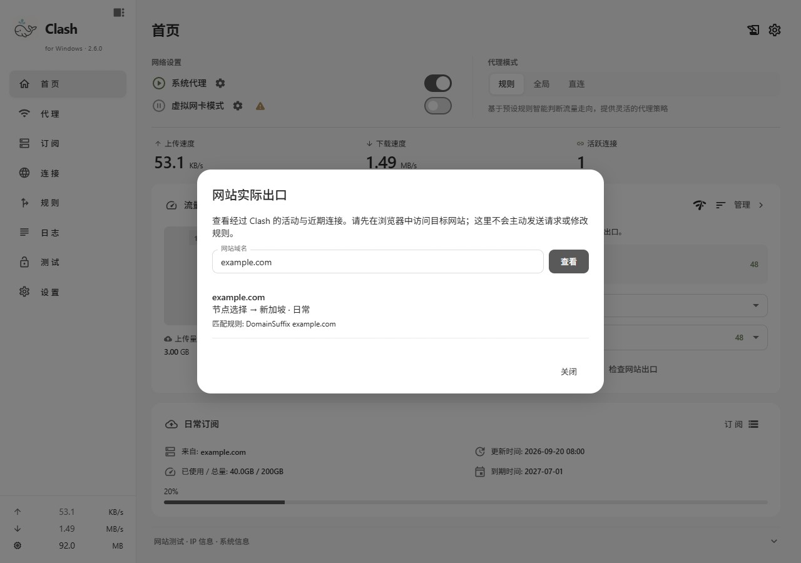

<p align="center"></p>
<h1 align="center">Clash</h1>
<p align="center">柔和、清晰、专注效率的桌面代理管理工具</p>
<p align="center"><a href="#界面预览">界面预览</a> · <a href="#开始使用">开始使用</a> · <a href="#本地构建">本地构建</a> · <a href="docs/usage.md">使用说明</a></p>

基于 [Clash Verge Rev](https://github.com/clash-verge-rev/clash-verge-rev) 二次开发，保留 Mihomo 与既有代理管理能力，重点改善桌面界面的排版、交互和 Windows 安装体验。

## Windows 2.6.0

本版将仓库 `clash-mac` 分支 2.9.7 的页面设计带到 Windows：同一只线稿白鲸、同一套双白与炭黑主题，保留 Windows 原生窗口操作与现有代理能力。

| 页面 | 使用体验 |
| --- | --- |
| 首页 | 系统代理、TUN 与路由模式置顶；实时速度、关注代理组和流量趋势组成工作台；诊断信息按需展开。 |
| 代理 | 紧凑节点列表，切换中与选中状态明确；测速直接可用，搜索、排序和测速地址集中在更多菜单。 |
| 订阅 | 展示使用状态、流量和到期信息；高级覆写与脚本折叠收纳，原有编辑与更新功能保留。 |
| 设置 | 通用、外观、网络、备份、高级五分类；搜索跨分类查找，Windows UWP 工具等入口继续保留。 |
| 连接与规则 | 保持清晰表格和虚拟列表，统一工具栏、分隔线、字体与深浅色表面。 |
| 图标与安装 | 应用、托盘、安装器、桌面与开始菜单使用统一白鲸图标；覆盖升级刷新已有快捷方式图标。 |

网站出口查看只读取已有连接记录；关注的代理组不代表所有网站的出口。流量图可隐藏或切换低饱和彩色/单色，隐藏后仍显示实时速度和累计用量。

快捷键：`Ctrl+,` 打开设置，`Ctrl+1–8` 按当前导航顺序切换页面，`Ctrl+B` 折叠侧栏。输入框、编辑器和弹窗内不会抢占这些快捷键。

保留 Windows 已有的首次启动等待与代理就绪检查，不移植 Mac 分支的 DNS、自动测速、内核或系统服务变更。

## 界面预览

| 浅色首页 | 深色首页 |
| --- | --- |
|  |  |

<details>
<summary>设置与网站出口查看</summary>





</details>

以上为本版真实前端组件的隔离预览，使用演示订阅、节点和流量，不包含个人配置。替换截图只需覆盖 `docs/preview_light.jpg`、`preview_dark.jpg`、`preview_settings.jpg`、`preview_dialog.jpg`。预览不包含操作系统标题栏；安装后的窗口保留 Windows 原生按钮。

## 开始使用

1. 从[本仓库 Releases](https://github.com/mraz2766/clash_mraz/releases) 选择已手动发布的安装包；没有对应包时可自行构建。
2. Windows 双击安装 EXE，按向导完成安装。
3. 在“订阅”中导入自己的订阅或本地配置，然后在“代理”中选择节点。
4. 按需开启系统代理或 TUN；通过“连接”“规则”和“日志”查看运行状态。

项目不提供代理订阅。Windows 10 / 11 保留原生窗口控制与桌面交互；macOS 版本在独立的 `clash-mac` 分支维护，本次不修改该分支。

## 本地构建

准备 Node.js、pnpm、Rust MSVC 工具链及 Visual Studio C++ 桌面构建环境。版本约束以 `package.json` 和 `rust-toolchain.toml` 为准，完整步骤见 [Windows 构建说明](docs/windows-build.md)。

```sh
pnpm install
pnpm dev
```

| 命令 | 用途 |
| --- | --- |
| `pnpm typecheck` | TypeScript 类型检查 |
| `pnpm lint` | 前端代码检查 |
| `pnpm test` | 现有单元测试与安装包脚本检查 |
| `pnpm knip:check` | 未使用代码检查 |
| `pnpm build:fast` | 快速构建 Windows 安装包并打开安装向导 |
| `pnpm build` | 正式配置构建安装包并打开安装向导 |
| `pnpm build:fast --no-open` | 生成安装包但不打开 |

安装包位置：**`releases/Clash_2.6.0_x64-setup.exe`**。版本号随项目版本变化；旧安装包正在使用时，新包使用时间戳后缀。打开向导不会自动完成安装。

`pnpm web:dev` 只启动前端，普通浏览器缺少 Tauri 原生能力，不会运行代理核心。

## GitHub 工作流与应用更新

本仓库采用本地构建、手动发布。工作流已移除定时、推送和 PR 自动触发，仅保留手动或复用入口；日常提交不需要云端打包。历史失败邮件对应已经执行过的任务，关闭工作流不会撤回旧邮件。

**GitHub 构建与应用内自动更新是两套机制。** 应用更新端点和签名校验仍沿用上游，自有签名更新流程尚未建立。使用定制版时，建议从本仓库手动安装，避免上游更新覆盖定制界面。

为兼容已有配置，内部可执行文件名、服务标识、数据目录与 URL 协议仍保留原项目标识。它们不是漏改的界面名称。

## 文档与致谢

- [使用说明与常见问题](docs/usage.md)
- [Windows 构建与安装流程](docs/windows-build.md)
- [视觉与交互规范](docs/ui-design.md)
- [Logo 与平台图标资源](docs/branding.md)
- [参与开发](CONTRIBUTING.md)

感谢 [Clash Verge Rev](https://github.com/clash-verge-rev/clash-verge-rev)、[Clash Verge](https://github.com/zzzgydi/clash-verge) 和 [Mihomo](https://github.com/MetaCubeX/mihomo) 的作者及贡献者。交互参考 [Amicro](https://github.com/Subhan-code/Amicro--Micro-transitions-)，Logo 整理参考 [ip-as-logo-skill](https://github.com/s1dashu/ip-as-logo-skill)，最终白鲸形象以用户提供的参考为基础。

沿用 [GPL-3.0-only](LICENSE) 许可证，保留上游版权、第三方归属与历史更新记录。
