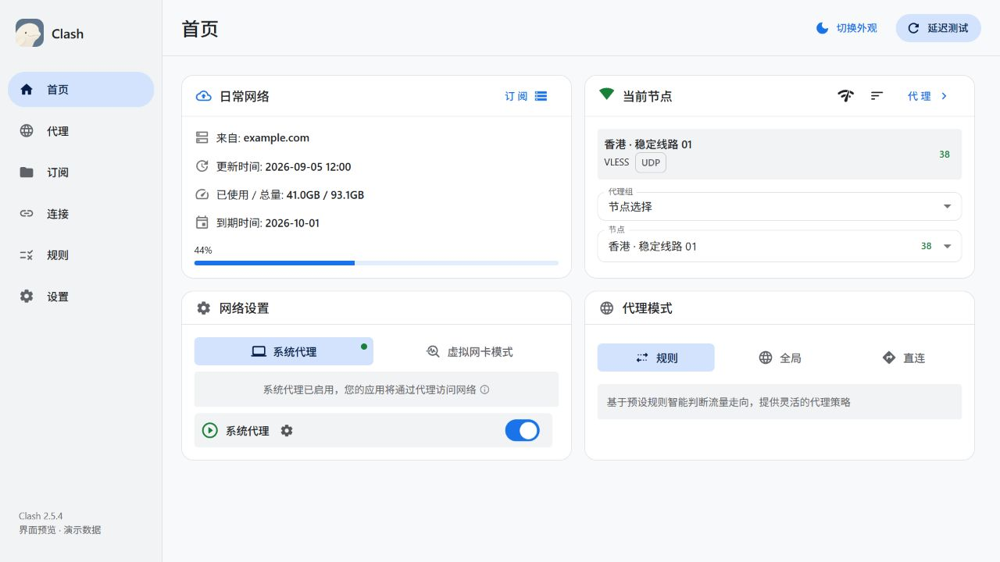

# 视觉与交互规范

## 技术与边界

前端采用 React 19、Material UI 9、Emotion 与 SCSS。主题由 `useCustomTheme` 统一生成，状态继续使用既有 hooks、SWR 和外部 store。原生能力来自 Tauri，虚拟列表使用 TanStack Virtual。本次没有引入 Motion 或其他动效依赖。

## 颜色与排版

浅色背景 `#F8F9FA`、白色 Surface、主色 `#1A73E8`；深色背景 `#202124`、Surface `#292A2D`、主色 `#8AB4F8`。选中态使用低饱和蓝色容器，成功/警告/错误使用语义色。

组件读取 `--md-*` 变量。圆角采用 6 / 8 / 12 / 16 / 22px，正文 14px，页面标题 24px/500，避免大量粗体和装饰阴影。

字体栈：Segoe UI Variable、Segoe UI、系统字体、Helvetica Neue、Arial、sans-serif。没有外部字体请求，也不依赖 macOS 专属外观 API。

## 动画规则

统一配置位于 `src/lib/motion.ts`，主题将其同步为 CSS 变量。

| 场景 | 时长与表现 |
| --- | --- |
| 按钮 | 140ms 颜色过渡，按下轻微缩小，悬停不放大 |
| 导航 | 180ms 选中底色移动，文字与图标颜色过渡 |
| 页面 | 220ms 淡入与 4px 位移；不保留旧页面等待退出 |
| 节点 | 180ms 选中背景变化、按下反馈、延迟数字轻微淡入 |
| 分组 | 展开箭头旋转；虚拟列表高度立即更新以保持测量正确 |
| 弹窗 | 200ms 淡入、4px 位移与 0.97 缩放，关闭 160ms |
| 菜单 | 短淡入与轻缩放，保留原锚点和键盘控制 |
| 开关、标签页 | 统一颜色与位置过渡，无弹跳 |
| 提示 | 小型 Snackbar，使用统一进入过渡 |

缓动统一为 `cubic-bezier(0.2, 0, 0, 1)`。动画不延迟网络请求、点击或状态提交。开启减少动态效果后关闭位移、缩放和页面动画。

## 性能取舍

不对每个虚拟行设置入场、延迟或高度动画，不为列表添加永久 `will-change`。大分组展开仍立即计算高度，避免动画高度与滚动测量冲突。Snackbar 删除和列表增删仍遵循原有生命周期，后续可在独立性能验证后引入完整退出与重排动画。

参考 [Amicro Fade Up](https://github.com/Subhan-code/Amicro--Micro-transitions-/blob/main/registry/ui/fade-up.json) 的透明度与位移组合，但将示例的 20px/600ms 调整为适合桌面的 4px/220ms；没有复制其展示型卡片或增加依赖。

## 验证

文档截图由实际前端组件配合演示数据生成。代码检查、Windows 打包与截图检查在提交说明中记录；macOS 实机、高 DPI 多屏、真实代理流量和大量节点压力测试应在对应环境继续验证。
## 设置与弹窗预览

## 首页精简

首页的订阅与代理跳转使用文字按钮，延迟数字使用语义文字色；网络设置与代理模式改为柔和的选中容器。去掉说明框的蓝色边框、连接线和重复阴影，保留原有控件、说明和操作。可点击模式项使用真实按钮，支持键盘焦点和按下状态。

页面标题、侧栏与内容区统一使用画布底色，取消横贯页面和侧栏的分界线。首页卡片间距为 16px，内部水平留白为 20px，标题与正文通过间距区分，不再重复画分割线。卡片轮廓采用 `--md-outline-soft`，节点摘要和开关行采用 `--md-surface-subtle`；输入框仍使用较清晰的 `--md-outline`。这些变量分别提供浅色和深色值，不依赖透明窗口或毛玻璃。下方截图记录上一版组件结构，灰白层次以当前应用为准。

